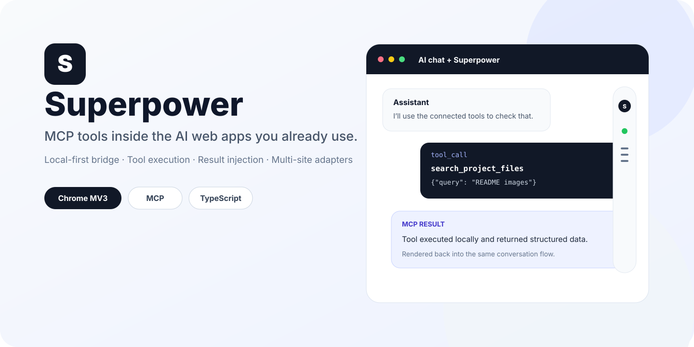
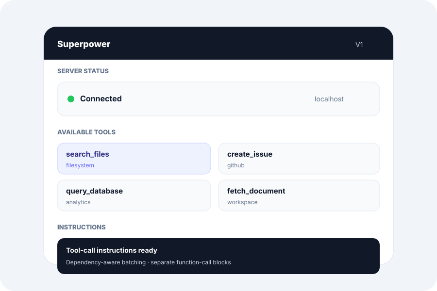
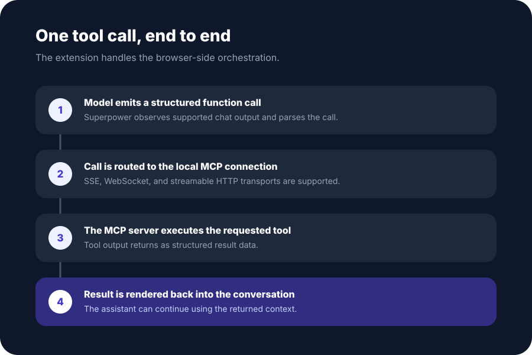
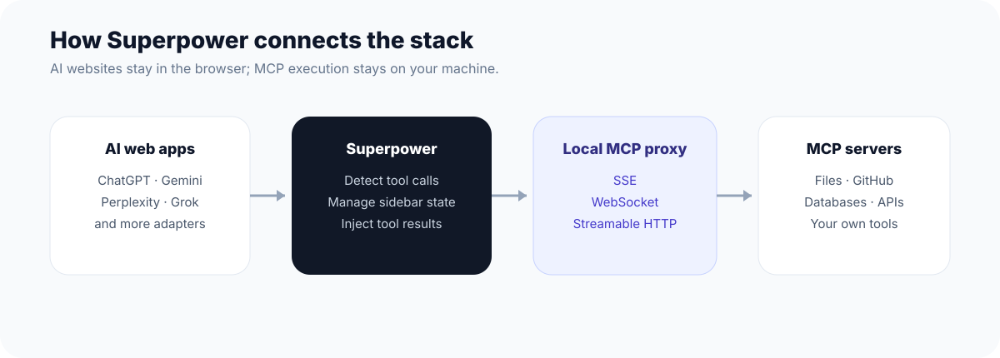

<div align="center">
  

  <h1>Superpower</h1>

  <p><strong>Bring MCP tools into the AI web apps you already use.</strong></p>
  <p>Run local and remote MCP tools from ChatGPT, Gemini, Perplexity, Grok, GitHub Copilot and other supported web assistants without leaving the conversation.</p>

  <p>
    <a href="https://github.com/stloendays/Superpower-V1/stargazers"></a>
    
    
    
    
    <a href="LICENSE"></a>
  </p>

  <p>
    <a href="#quick-start">Quick start</a> ·
    <a href="#features">Features</a> ·
    <a href="#supported-platforms">Supported platforms</a> ·
    <a href="#how-it-works">Architecture</a> ·
    <a href="#development">Development</a>
  </p>
</div>

<p align="center">
  
</p>

## What is Superpower?

Superpower is a Chrome extension that connects supported AI web interfaces to the [Model Context Protocol](https://modelcontextprotocol.io/) through an MCP proxy. It detects structured tool calls in the conversation, routes them to connected MCP servers, executes the requested tools, and renders the results back into the same chat workflow.

The browser UI stays where you already work. MCP execution stays behind the local or remote endpoint you configure.

## Features

<table>
<tr>
<td width="50%" valign="top">

### MCP control inside the page

- Connection status and transport selection
- Available-tool discovery and enable/disable controls
- MCP instruction generation and insertion
- Automation delay settings
- Persistent sidebar and user preferences

</td>
<td width="50%" valign="top">

### Tool execution workflow

- Detect structured function calls in supported assistants
- Render tool-call and tool-result blocks
- Manual or automated execution flows
- Insert results back into the conversation
- ChatGPT MCP attachment handling in V1

</td>
</tr>
</table>

<table>
<tr>
<td width="50%" align="center" valign="top">
  
  <br /><sub>Illustrated sidebar overview based on the current V1 controls.</sub>
</td>
<td width="50%" align="center" valign="top">
  
  <br /><sub>A tool call from model output to MCP execution and result injection.</sub>
</td>
</tr>
</table>

### Built for real MCP workflows

Superpower supports **SSE**, **WebSocket**, and **Streamable HTTP** connections. Tool instructions are generated from the tools exposed by the connected server, while V1 adds dependency-aware batching guidance and separate function-call blocks to make multi-tool workflows easier for models to follow.

## Supported platforms

The current adapter set includes:

| Platform | Domain | Platform | Domain |
| --- | --- | --- | --- |
| ChatGPT | `chatgpt.com` | Google Gemini | `gemini.google.com` |
| Perplexity | `perplexity.ai` | Google AI Studio | `aistudio.google.com` |
| Grok | `grok.com` / `x.com` | OpenRouter | `openrouter.ai` |
| DeepSeek | `chat.deepseek.com` | T3 Chat | `t3.chat` |
| GitHub Copilot | `github.com/copilot` | Mistral | `chat.mistral.ai` |
| Kimi | `kimi.com` | Qwen Chat | `chat.qwen.ai` |
| Z.ai | `chat.z.ai` |  |  |

Web UI changes can affect DOM-based adapters. If one platform changes its composer or response markup, open an issue with the affected platform and browser version.

## How it works

<p align="center">
  
</p>

At a high level:

1. A supported AI website produces a structured tool call.
2. Superpower detects and parses the call in the browser.
3. The call is forwarded through the configured MCP connection.
4. The MCP server executes the tool and returns its result.
5. Superpower renders or inserts the result back into the conversation so the model can continue.

## Quick start

### Requirements

- Node.js **22.12+**
- pnpm **9.x**
- Chrome or another Chromium-based browser
- One or more MCP servers you want to expose through the proxy

### 1. Clone and install

```bash
git clone https://github.com/stloendays/Superpower-V1.git
cd Superpower-V1
pnpm install
```

### 2. Create an MCP proxy configuration

Create `config.json` outside the repository or in a local ignored path:

```json
{
  "mcpServers": {
    "example-server": {
      "command": "npx",
      "args": ["-y", "your-mcp-server-package"]
    }
  }
}
```

Do not commit credentials, API keys, access tokens, or private machine paths.

### 3. Start the MCP proxy

SSE:

```bash
npx -y @srbhptl39/mcp-superassistant-proxy@latest \
  --config ./config.json \
  --outputTransport sse
```

Other supported proxy transports:

```bash
# Streamable HTTP
npx -y @srbhptl39/mcp-superassistant-proxy@latest --config ./config.json --outputTransport streamableHttp

# WebSocket
npx -y @srbhptl39/mcp-superassistant-proxy@latest --config ./config.json --outputTransport ws
```

> The proxy package currently retains the upstream `mcp-superassistant-proxy` package name. Superpower V1 uses it as an external compatibility dependency.

### 4. Build the extension

```bash
pnpm base-build
```

The unpacked extension is generated in `dist/`.

### 5. Load it in Chrome

1. Open `chrome://extensions/`.
2. Enable **Developer mode**.
3. Select **Load unpacked**.
4. Choose the generated `dist/` directory.
5. Open one of the supported AI websites and use the Superpower sidebar to connect to your MCP endpoint.

### Connection endpoints

The default V1 connection is SSE at `http://localhost:3006/sse`.

| Transport | Typical local endpoint |
| --- | --- |
| SSE | `http://localhost:3006/sse` |
| Streamable HTTP | `http://localhost:3006/mcp` |
| WebSocket | `ws://localhost:3006/message` |

## Typical workflow

1. Start the MCP proxy and confirm the desired MCP servers are available.
2. Open a supported AI platform.
3. Connect Superpower to the proxy from the server-status UI.
4. Choose which tools should be exposed to the assistant.
5. Insert or attach the generated MCP instructions when needed.
6. Ask the assistant to perform a task that requires one of the enabled tools.
7. Review the detected function call and run it manually, or use the available automation controls.
8. Continue the conversation with the returned tool result.

## V1 highlights

Superpower V1 focuses on the project transition and the browser-side MCP workflow:

- Superpower branding and a new minimalist extension icon
- Chrome extension version `1.0.0` with display version `V1`
- Dependency-aware MCP instruction guidance for multi-tool workflows
- Separate function-call blocks in generated instructions
- ChatGPT MCP-file submission refresh handling
- Release-oriented environment templates, security notes, attribution, and repository cleanup

See [CHANGELOG.md](CHANGELOG.md) for the release summary.

## Development

### Development build

```bash
pnpm dev
```

### Production build

```bash
pnpm base-build
```

### Type checking and linting

```bash
pnpm type-check
pnpm lint
pnpm prettier
```

### Firefox build

The monorepo still includes the upstream Firefox build path:

```bash
pnpm build:firefox
```

Browser behavior and support should be validated separately before publishing a Firefox release.

## Repository structure

```text
Superpower-V1/
├── chrome-extension/          # Manifest V3 extension core and background service
├── pages/content/             # Content UI, adapters, tool rendering, sidebar
├── packages/                  # Shared monorepo packages
├── scripts/                   # Local repository setup helpers
├── docs/readme/               # README visual assets
├── CHANGELOG.md
├── SECURITY.md
├── NOTICE.md
└── README.md
```

## Security

MCP servers can expose powerful capabilities such as filesystem access, developer tools, databases, and third-party APIs. Only connect Superpower to endpoints you trust.

In particular:

- Keep local proxy ports private unless you intentionally configure network access and authentication.
- Review the tools exposed by each MCP server before enabling automation.
- Keep secrets in local environment/configuration files that are excluded from Git.
- Treat tool output and file attachments as potentially sensitive data.

See [SECURITY.md](SECURITY.md) for project-specific guidance.

## Contributing

Issues and pull requests are welcome. For adapter bugs, include the affected AI platform, browser version, reproduction steps, and the relevant page behavior. Keep unrelated refactors separate from compatibility fixes so DOM-adapter changes are easier to review.

## Upstream and attribution

Superpower V1 is a modified derivative of [MCP SuperAssistant](https://github.com/srbhptl39/MCP-SuperAssistant), originally developed by Saurabh Patel.

The upstream project is MIT licensed. The original copyright notice is preserved in [LICENSE](LICENSE), and additional attribution is recorded in [NOTICE.md](NOTICE.md).

## License

Released under the [MIT License](LICENSE).
